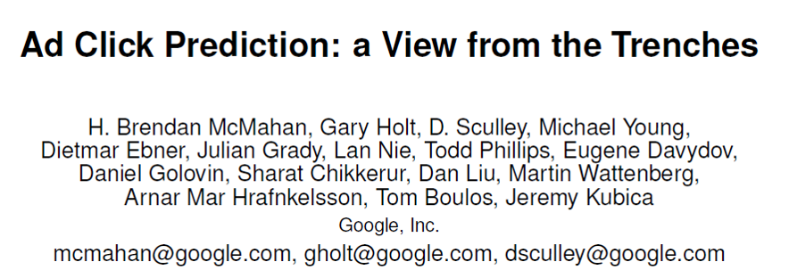
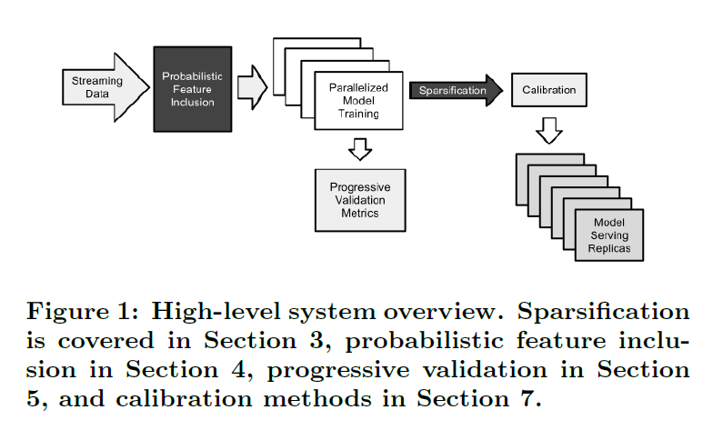
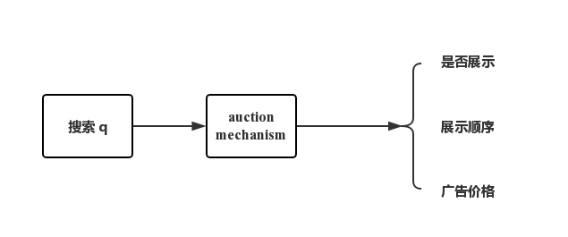
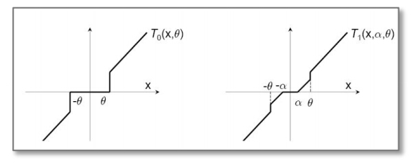

# 点击率预测

## 1. 简介

- 点击率是一个重要是一个重要的预测问题。很多问题都依赖于此，广告推荐、实时竞价等；问题的规模之大在十年前都难以想象。
- 本文介绍Google的几个案例，重点放在关注很少但是同样重要的几个点上：减少内存、性能分析、预测的可信度、标准化、特征管理等。本文目标是启发读者在大规模数据问题上的思考。

## 2. 系统概览

- 给出一个搜索 ***q*** ，通过一个拍卖机制（auction mechanism）来确定是否展示给用户、展示的顺序和如果点击广告应收取的费用。另外，对于一个广告 ***a*** ，拍卖机制一个重要的输入就是点击率 
  $$
  P(click | q, a)
  $$
  

- 广告系统数据来源复杂，数据有很强的稀疏性

- **正则逻辑回归（regularized logistic regression）**等方法十分适合这种情况的问题，数据量很大需要在线训练，数据通常以**流（stream）式服务**供给，感兴趣看 Photon system

- 本文不详细介绍**大规模学习（large-scale learning）**，文中使用Downpour SGD 训练模型，模型层数为1，因为模型会复制多个版本部署于多个数据中心，所以相比于训练时间，我们更感兴趣服务时花费的时间。

## 3. 在线学习和稀疏性

对于大规模的数据，通用的线性模型的在线算法就能取得很好的效果，本文采用逻辑回归。

逻辑回归的概率公式为
$$
p_t =\sigma({\bf w}_t \cdot {\bf x}_t)
$$
$$
\sigma(a) = 1/(1+exp(-a))
$$

损失函数为
$$
l_t({\bf w}_t)=-y_t{\rm log}(p_t)-(1-y_t){\rm log}(1-p_t)
$$
训练算法为Online gradient descent(OGD)，思想和stochastic gradient descent(SGD)一样，重在强调不是batch而是序列样本；OGD存在问题——不能有效产生稀疏模型，所以出现了很多提高稀疏性的算法。

### 3.0 稀疏性算法概览（参考[博客1](https://blog.csdn.net/china1000/article/details/51176654)和[博客2](https://blog.csdn.net/fangqingan_java/article/details/51020653)）

1. TG算法

   - L1正则化

     ​	由于L1正则项在0处不可导，往往会造成平滑的凸优化问题变成非平滑的凸优化问题，因此可以采用次梯度(Subgradient)来计算L1正则项的梯度。权重更新方式为：
     $$
     {\bf w}_{t+1}={\bf w}_t-{\eta}_t{\bf g}_t-{\eta}_t\lambda{\rm sgn}({\bf w}_t)
     $$
     ​       其中$ {\lambda} $是一个标量，为L1正则化的参数；${\bf w}_t$是一个向量，${\rm sgn}({\bf w}_t)$为符号函数；${\eta}_t$为学习率，通常将其设置为$\frac{1}{\sqrt{t}}$的函数；${\rm g}_t={\nabla}_{\rm w}l_t({\bf w}_t)$代表第$t$次迭代中损失函数的梯度。

     ​	模型稀疏控制参数$\lambda$会将接近0的参数趋近于0.

   - 简单截断法

     ​	由于L1正则化不能产生很好的稀疏性，可以简单粗暴地设置一个阈值，当某维权重小于该阈值时直接置0，这就是简单截断法。简单截断法以$k$为窗口，当$\frac{t}{k}$不为整数时采用标准的SGD进行迭代，当$\frac{t}{k}$为整数时，权重更新方式如下：
     $$
     {\rm w}_{t+1}=T_0({\rm w}_t-\eta_t{\rm g}_t,\theta)
     $$

     $$
     T_0({\rm v},\theta)=
     \begin{cases}
     0,  & if \left| v_i \right| \leq 0\\
     v_i, & otherwise
     \end{cases}
     $$

     ​	这里$\theta$是一个正数，可以调节稀疏性；${\rm v}$是一个向量。

   - 梯度截断法

     ​	简单截断法法简单且易于理解，但是在实际训练过程中的某一步，${\rm w}$的某个特征系数可能因为该特征训练不足引起的，简单的截断过于简单粗暴(too aggresive)，会造成该特征的缺失。那么我们有没有其他的方法，使得权重的归零和截断处理稍微温柔一些呢？对，就是梯度截断法。简单截断法和梯度截断法对特征权重的处理映射图对比如下：

     ​            

     ​	梯度截断法的迭代公式如下：
     $$
     {\rm w}_{t+1}=T_1({\rm w}_t-\eta_t{\rm g}_t,\theta)
     $$

     $$
     T_1({\rm v},\alpha,\theta)=
     \begin{cases}
     {\rm max}(0, v_i-\alpha),  & if \quad v_i \in [0,\theta] \\
     {\rm min}(0, v_i-\alpha),  & if \quad v_i \in [-\theta,0] \\
     v_i, & otherwise
     \end{cases}
     $$

     ​	参数$\lambda$ 和$\theta$ 控制模型稀疏度，值越大越稀疏。

2. FOBOS算法

   ​	FOBOS(Forward-Backward Splitting)是由John Duchi和Yoram Singer提出的。FOBOS算法把正则化的梯度下降问题分成一个经验损失梯度下降迭代和一个最优化问题。其中第二个最优化问题有两项：第一项2范数那项表示不能离loss损失迭代结果太远，第二项是正则化项，用来限定模型复杂度、抑制过拟合和做稀疏化等。
   $$
   {\bf w}_{t+1/2}={\bf w}_t-{\eta}_t{\bf g}_t
   $$

   $$
   {\bf w}_{t+1}={\rm argmin}\{\frac{1}{2}\left\|{\rm w}-{\rm w}_{t+1/2}\right\|^2+\eta^{t+1/2}\Psi({\rm w})\}
   $$

   ​	权重更新分为两个部分，第一步先进行一步标准的梯度下降；然后对结果进行微调，即满足最速下降又保证了一定的稀疏性。 
   ​	其中$\Psi({\rm w}_t)$是正则项可以对权重进行约束，常用的选择为L1，则对应的方法为L1-FOBOS

3. RDA算法（正则对偶平均）

   ​	之前的算法都是在SGD的基础上，属于梯度下降类型的方法，这类型的方法的优点是精度比较高，并且TG、FOBOS也能在稀疏性上得到提升。但是RDA却从另一个方面进行在线求解，并且有效提升了特征权重的稀疏性。RDA是Simple Dual Averaging Scheme的一个扩展，由Lin Xiao发表与2010年。

   ​	权重更新策略为：
   $$
   {\bf w}_{t+1}={\rm argmin}\{
   \frac{1}{t}\sum_{r=1}^t <{\rm g}_t,{\rm w}> +
   \Psi({\rm w}) +
   \frac{\beta^t}{t}h({\rm w})
   \}
   $$
   ​	权重更新包括三个部分第一部分线性加权，即对历史梯度进行加权平均；第二部分正则项部分对特征进行稀疏化；第三部分严格递增序列相当于额外的正则项。 
   ​	实验证明该方法能够产生较好的稀疏和精度。

4. FTRL算法

   ​	FTRL是Google提出的在线算法，由于其在工程实现上进行了大量优化，在工业界应用非常广泛。

   - 权重更新策略
     $$
     {\rm w}_{t+1}=argmin({\rm g}_{1:t}{\rm w}+\frac12\sum_{s=1}^t\sigma_s||{\rm w}-{\rm w}_s||^2+\lambda_1||{\rm w}||+\frac12 \lambda_2||{\rm w}||^2)
     $$

   - 公式推导
     $$
     F({\rm w})={\rm g}_{1:t}{\rm w}+\frac12\sum_{s=1}^t\sigma_s||{\rm w}-{\rm w}_s||^2+\lambda_1||{\rm w}||+\frac12 \lambda_2||{\rm w}||^2 \\
     ={\rm g}_{1:t}{\rm w}+\frac12\sum_{s=1}^t\sigma_s({\rm w}^T{\rm w}-2{\rm w}^T{\rm w}_s+{\rm w}_s^T{\rm w}_s)+\lambda_1||{\rm w}||+\frac12 \lambda_2||{\rm w}||^2 \\
     =({\rm g}_{1:t}-\sum_{s=1}^t\sigma_s {\rm w}_s) {\rm w}+\frac12(\sum_{s=1}^t\sigma_s+\lambda_2){\rm w}^T{\rm w}+\lambda_1||{\rm w}||+const \\
     ={\rm z}_t^T {\rm w}+\frac12(\frac 1 \eta_t+\lambda_2){\rm w}^T{\rm w}+\lambda_1||{\rm w}||+const
     $$
     其中${\rm z}_{t-1}={\rm g}_{1:t-1}-\sum_{s=1}^{t-1}\sigma_s {\rm w}_s$，根据定义可以得到${\rm z}_{t-1}={\rm z}_{t-1}+{\rm g}_t-(\frac 1\eta_t-\frac 1\eta_{t-1}){\rm w}_t$

     对上式进行求导可以得到:
     $$
     {\rm z}_t+(\frac 1 \eta_t+\lambda_2){\rm w}+\lambda_1 \partial|{\rm W}|=0
     $$
     从上式中可以容易得到w和z必须是异号，否则等式不能成立。 
     因此根据L1正则的次导数和梯度公式，讨论如下。
     $$
     \partial |W| =
     \begin{cases}
     0,  & \text{if $-1<w<1$ } \\
     1, & \text{if $w>1$ } \\
     -1 , & \text{if $w<-1$}
     \end{cases}
     $$

     - 当$|{\rm z}_{t_i}|<\lambda_1$时

       ${\rm w}_i>0$，则有${\rm w}=\frac{-{\rm z}_i-\lambda_1}{\frac 1 \eta_t+\lambda_2} < 0$不成立

       ${\rm w}_i<0$，则有${\rm w}=\frac{-{\rm z}_i-\lambda_1}{\frac 1 \eta_t+\lambda_2} > 0$不成立

       ${\rm w}_i=0$

     - 当${\rm z}_{t_i}>\lambda_1$时

       由于两者必须异号，此时有${\rm w}_i < 0$，${\rm w}=\frac{-{\rm z}_i+\lambda_1}{\frac 1 \eta_t+\lambda_2}$

     - 当${\rm z}_{t_i}<-\lambda_1$时

       同理有${\rm w}=\frac{-{\rm z}_i+\lambda_1}{\frac 1 \eta_t+\lambda_2}$

     因此有：
     $$
     {\rm w}_i =
     \begin{cases}
     0,  & \text{if $|{\rm z}_i| \le \lambda_1$ } \\
     \frac{-({\rm z}_i-sgn({\rm z}_i)\lambda_1)}{\frac 1 \eta_t+\lambda_2}, & \text{if $others$ } 
     \end{cases}
     $$

### 3.1 Per-Coordinate Learning Rates

