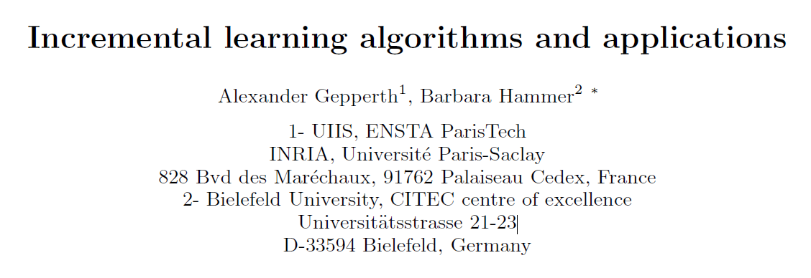

# Incremental learning algorithms and applications

## 1. 什么是增量式学习（Incremental learning）？

​	机器学习能够很好的抓取数据的内在特征，但是大部分机器学习应用都是数据在训练之前就准备好了，整个训练的过程基于“数据及其内在特征是静态的”这一假设。而**增量式学习**是针对流式数据的模型演化过程，这个过程中可能存在用户反馈这一过程（强化学习？），当然也会出现因为整个数据集太过庞大而使用流式训练的情况。下面会先基于监督学习，说明**在线学习**、**增量式学习**、**概念漂移**三个术语。

## 1.1 在线学习方法

​	在监督学习中，给定数据$D=((\vec{x_1}, y_1), (\vec{x_2}, y_2), (\vec{x_3}, y_3), . . . , (\vec{x_m}, y_m))$，求解模型$M \approx p(y | \vec{x})$，常用的训练方式是批量训练的方式。

​	而**在线学习（Online learning）**中，数据$D$并不是在训练之前就准备好的，而是随着时间不断增多，所以任务就变成了，根据$t-1$时刻的模型$M_{t-1}$和$t$时刻的数据$(\vec{x_t},y_t)$，推出$t$时刻的模型$M_t$。

​	在线学习可以使用onlineBP算法，但也有人使用扩展的SVM。vector quantisation，radial basis function networks (RBF)， supervised learning vector quantisation (LVQ)和self-organising maps (SOM)这些基于原型的算法都可以做在线学习，因为他们都基于梯度下降。二阶数值优化模型也可以扩展为在线学习，例如variational Bayes，convex optimization，second order perceptron learningbased on higher order statistics in primal or dual space 以及 online realisations of the quasi-Newton Broyden-Fletcher-Goldfarb-Shanno technique。而k-NN的训练过程本质上就是在线学习。

## 1.2 增量式学习

​	**增量式学习（Incremental learning）**可以看做“内存精简版”的在线学习，即在内存有限的情况下进行在线学习。

​	**概念漂移（Concept drift）**指的是随着数据流的不断到来，训练数据的整体统计特性是变化的，数据分布的变化我们称为概念漂移。$p(\vec{x})$的变化称为虚拟概念漂移（virtual concept drift）或者covariate shift，而$p(y|\vec{x})$的变化称为真实数据漂移（real concept drift）。另外，漂移可能是渐变也可能是突发的。

​	**稳定性/可塑性两难问题（The stability-plasticity dilemma）**，在噪声很大或者发生概念漂移的环境下，应该如何调整模型是一个两难问题。迅速偏向新变化，会使模型忘记旧数据，缓慢接受新变化会降低模型的反应速度。许多在线学习模型不能解决这个两难问题，就算新旧数据并未发生冲突，模型仍然会出现出现**灾难性遗忘（catastrophic forgetting）**这个问题。【注：灾难性遗忘在深度学习中也常常出现，新的学习任务会擦出旧的参数】。很多文献试图解决这个问题，如ART networks，just-in-time classifier JIT，hybrid online/offline methods等，这些方法的核心是模型预测结果的置信度评估，从而提出一个复杂的增量策略。

​	**适应性的模型复杂度和元参数**，对于增量式学习来说，因为数据是未知的，所以模型复杂度是变化的。模型在某个时刻是会达到自身的极限的（比如数据突然出现新的一个类别），这就要求算法能够自动地扩展，比如增量式结构、自调节基础单元的极限学习机、基于原型的算法、数据表征里面的增量式基础函数选择、以及无监督学习里的自调节聚类参数等。这些策略都归属于更大的研究课题——自我进化的系统。在批量学习的过程中，除了模型复杂度，元参数也是在训练之前就可以设定好的（比如学习率）。但是在增量式学习中，这些参数在概念漂移出现时是应该做出调整的，所以元参数是也要归入训练过程的，或者说增量式学习会把批量学习的很多元参数变成普通参数。

​	**高效的内存模型**，因为资源有限，增量式学习会以压缩形式来存储模型。

​	**模型评价**，一般有两种评价方式：*增量式与非增量式对比*，获得模型$M_t$之后，在测试集或者通过交叉验证的方式对比模型和批量式模型，通常增量式因为受限于数据，效果会更差；*增量式与增量式对比*，获得模型$M_t$之后，通常计算在线表现$||M_t(\vec{x_{t+1}})-y_{t+1}||$，然后会计算整体均值。当然随着在线学习模型的增多，人们会以独立同分布的数据来评价模型的分类表现、收敛速度、以及可推广性。近年来，通用线性回归等方法在保证收敛的同时独立同分布的要求也被放宽，详细信息参见论文。

## 2. 增量式学习的模型

​	增量式学习种类多样，比如某些模型并不限制内存或者专门针对稳态分布设计；而且增量式学习的目标也不一样，本部分仅针对监督学习进行总结，同时还存在其他部分，例如聚类、降维、特征选择、数据表示、强化学习、数据挖掘等等。

- 解决概念漂移：有很多解决概念漂移的办法，分类也各不相同，例如渐变的数据分布需要消极方案，剧变的数据分布需要积极方案。对于虚拟概念漂移，一种方法是“重要性权重”，即给样本分配一个表示重要性的权重；对于真实概念漂移，可以使用统计测试，比如Hellinger distance。【海林格距离用来度量两个概率分布的相似度】
- SVM和通用线性模型：有些算法在SVM里面引入启发式方法，但是没有理论证明；adiabatically SVM可以一次输入一个样本，但是要存储所有样本；集成学习（Ensemble learning）引入之后，每次训练一个分类器，最后做一个分类器的决策树；还有把基于原型的数据表示和SVM结合在一起的方法。很多线性模型都有在线版本，例如高斯过程回归，但是他们都没有解决概念漂移问题。
- 联结主义模型：多层感知机（MLP）是联结主义模型的代表，最主要的问题是解决遗忘灾难问题，许多算法修改致力于解决这一问题——sparsification, orthogonalization of internal node weights, reduction of representational overlap while training, or specific regularisation。另外还有极限学习机。
- 显示划分方法：许多增量式方法需要对输入进行划分，所以树结构有天然的优势，但是要注意资源。
- 集成方法：用来处理概念漂移的常用手段。
- 基于原型的方法：kNN，RBF，LVQ等
- 仿生学方法：神经网络的结构很像，但是现有的神经网络并不能直接应用于增量式学习。

## 3. 增量式学习应用

- 数据分析和大数据处理
- 机器人
- 图像处理
- 自动化标注
- 离群点检测

