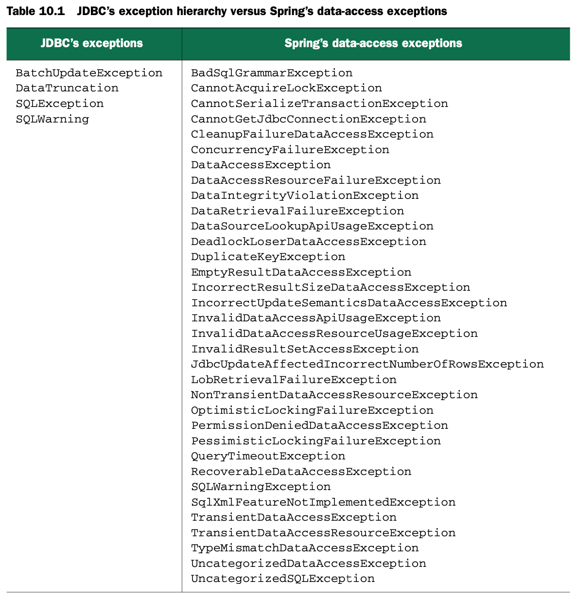
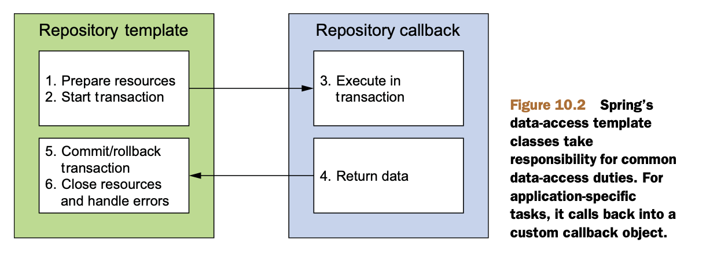
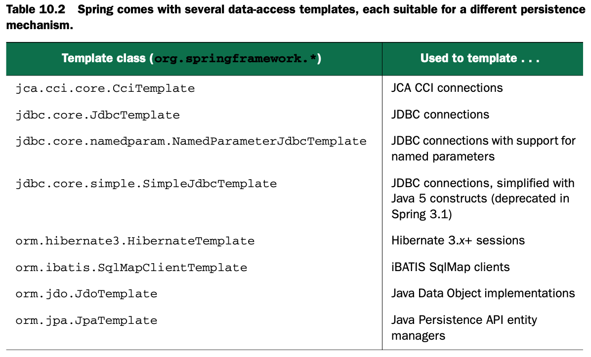

# Hitting the database with Spring and JDBC

## 10.1 Learning Spring's data-access pholosophy

**使用接口（Interface）**，这样有解耦、隐藏后端实现、便于测试等好处。

### 10.1.1 Getting to know Spring's data-access exception hierarchy

如果自己写JDBC代码，需要捕获各种异常，有太多问题会造成SQLException：

- 连不上数据库
- SQL语法问题
- 表或者字段没有
- 违反数据库约束
- 等等

一些持久化框架提供丰富的异常体系，比如Hibernate能提供二十多个异常；但是为什么我们要了解spring的SQL异常体系，因为：

1. JDBC的异常体系太多了，不同框架有不同的体系
2. Hibernate的体系适用于自己，spring提供的框架不能受限于某一特定框架（接口思想）

**Spring's persistance platform-agnostic exceptions**

Spring的异常体系比JDBC丰富得多，而且不受限与某一特定的持久化框架。异常举例

上面提到的这些异常都是DataAccessException的子类，而DataAccessException是一个不需要检查的异常，所以无需一一捕获。

### 10.1.2 Temlating data access

有效的设计模式：the template method pattern

spring把固定化的代码和每次可能不一样的代码拆成*templates*和*callbacks*，Templates负责管理那些固定化的代码，Callbacks负责那些可能不同的代码，如下图所示

依据你选择的持久化框架，在spring中可以做不同的选择，如下图所示

## 10.2 Configuring a data source