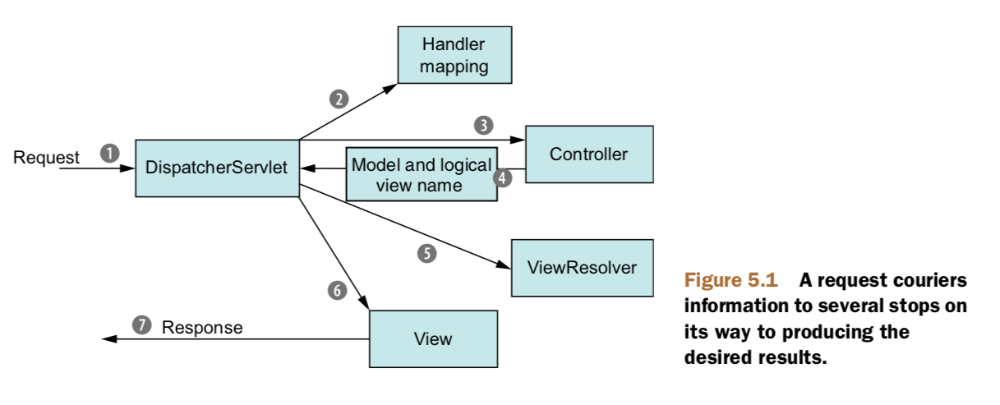
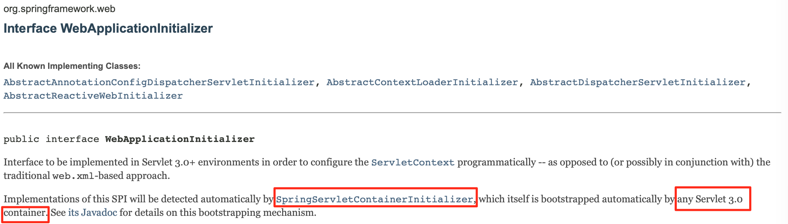

# Building Spring web applications

对于java程序员来说，主要工作大部分是web开发，状态控制、工作流、验证等等都是需要重点关注的特性，然而这些特性要基于无状态的http协议来实现就不是那么简单了。

spring的网络框架是为了解决这些任务专门设计的，Spring MVC可以帮助建立灵活、低耦合的web程序。

这一章主要讲解Spring MVC框架。

## 5.1 Getting started with Spring MVC

### 5.1.1 Following the life of a request



上图所示就是一个Request的声明周期。

①浏览器发起请求，携带用户的请求信息到达Spring的`DispatcherServlet`；像大多数Jave web程序一样，Spring MVC通过一个单一的前台控制器servlet来处理request，这个前台的控制器就是`DispatcherServlet`。

②`DispatcherServlet`需要把request转发到相应的`Controller`，但是可能会有很多不同的`Controller`，所以需要`Handler mapping`的帮助；`Handler mapping`主要关注request携带的url。

③一旦确定好对应的`Controller`，`DispathcerServlet`就会把request发向该`Controller`；`Controller`以及其背后的各种service负责对这个request进行处理，主要是处理request携带的信息。

④然后`Controller`把需要回传的信息`model`和`view name`送还给`DispatcherServlet`。

⑤`DispatcherServlet`向`ViewResolver`咨询应该怎样把手中的`model`和`view name`构成一个用户可接受的形式。

⑥`DispatcherServlet`通过咨询结果，把手中的信息发送给对应的视图解析器`View`。

⑦`View`构建出用户需要的视图发送出去，通常是一个JSP。

### 5.1.2 Setting up Spring MVC

虽然一个request要经过很多模块，但是Spring MVC不需要做很多配置。

**配置DispatcherServlet**

传统方式是在web.xml中配置，但是现在支持多种方式配置。下面展示的是利用Java进行配置的例子

```java
package spittr.config;
import org.springframework.web.servlet.support.AbstractAnnotationConfigDispatcherServletInitializer;

public class SpittrWebAppInitializer extends AbstractAnnotationConfigDispatcherServletInitializer {
  
  @Override
  protected String[] getServletMappings() {
    return new String[]{"/"};
  }
  
  @Override
  protected Class<?>[] getRootConfigClasses() {
    return new Class<?>[]{RootConfig.class};
  }
  
  @Override
  protected Class<?>[] getServletConfigClasses() {
    return new Class<?>[]{WebConfig.class};
  }
}
```

首先，所有继承`AbstractAnnotationConfigDispatcherServletInitializer`的类都会自动的被用来配置`DispatcherServlet`和spring application context。

> 主要的原因是Servlet 3.0环境中，容器会寻找classpath下所有实现了`javax.servlet.ServletContainerInitializer`接口的类来配置Servlet容器；又因为Spring提供了`WebApplicationInitializer`接口
>
> 
>
> 同时提供了该接口的一个基础实现类`AbstractAnnotationConfigDispatcherServletInitializer`

由代码可知，有3个方法被重写，`getServletMappings()`确定了一个或者多个的路径映射；为了搞清楚剩下的两个方法，首先了解下`DispatcherServlet`和`ContextLoaderListener`的关系。

**两种Application Context**

当`DispatcherServlet`开始运行，它会创建一个spring application context，并且载入配置文件中定义的bean。主要是依靠`getServletConfigClasses()`方法返回的`WebConfig`配置类。

但是在spring web application中，还有一个由`ContextLoaderListener`创建的application context。

`DispatcherServlet`一般用来载入web组件，例如controller、view resolver和handler mapping等；`ContextLoaderListener`一般用来载入程序中定义的其他bean，例如中间层和数据层的组件。

`AbstractAnnotationConfigDispatcherServletInitializer`同时创建`DispatcherServlet`和`ContextLoaderListener`