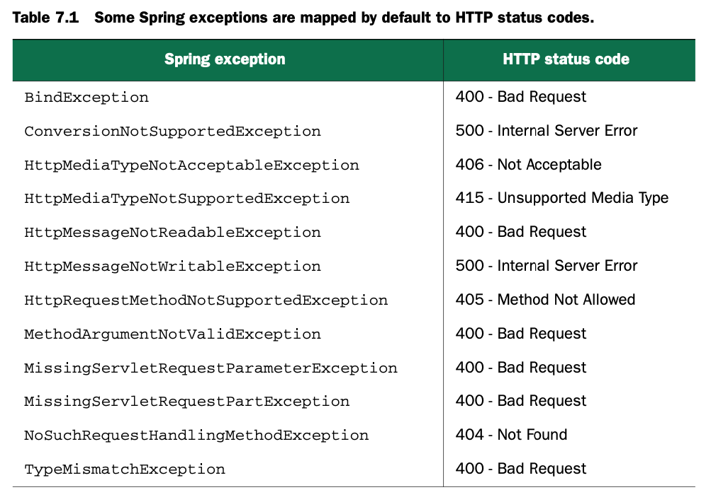

# Advanced Spring MVC

Spring MVC还有很多知识没有在第5、6章描述，本章举例。

## 7.1 Alternate Sprign MVC configuration

在第5章中，我们使用`AbstractAnnotationConfigDispatcherServletInitializer`对Spring MVC进行配置，但是有很多情况（比如使用3.0之前版本的servlet）下需要其他的配置方式。

###7.1.1 Customizing DispatcherServlet configuration 

```java
@Override
protected void customizeRegistration(Dynamic registration) {
  registration.setMultipartConfig(new MultipartConfigElement("/tmp/spittr/uploads"));
}
```

### 7.1.2 Adding additional servlets and filters

如果想在web容器中注册其他组件，只需要创建一个新的初始化类，最简单的方式是实现`WebApplicationInitializer`接口，例如

```java
package com.myapp.config;

import javax.servlet.ServletContext;
import javax.servlet.ServletException;
import javax.servlet.ServletRegistration.Dynamic;
import org.springframework.web.WebApplicationInitializer; import com.myapp.MyServlet;

public class MyServletInitializer implements WebApplicationInitializer {
  @Override
  public void onStartup(ServletContext servletContext) throws ServletException {
    Dynamic myServlet = servletContext.addServlet("myServlet", MyServlet.class);
    myServlet.addMapping("/custom/**");
  }
}
```

可以注册listener和filter，举个注册filter的例子：

```java
@Override
public void onStartup(ServletContext servletContext) throws ServletException {
  javax.servlet.FilterRegistration.Dynamic filter = servletContext.addFilter("myFilter",
                                                                            Myfilter.class);
  filter.addMappingForUrlPatterns(null, false, "/custom/*");
}
```

`WebApplicationInitializer`可以方便地注册servlet、filter和listener，但是如果你想单纯的增加filter，那么可以重写`AbstractAnnotationConfigDispatcherServletInitializer`，例如

```java
@Override
protected Filter[] getServletFilters() {
  return new Filter[] {new MyFilter()};
}
```

### 7.1.3 Declaring DispatcherServlet in web.xml

当使用Java代码配置时，`AbstractAnnotationConfigDispatcherServletInitializer`会自动注册一个`DispatcherServlet`和一个`ContextLoaderListener`；但是当使用web.xml配置时，需要亲力亲为。举例如下：

```xml
<?xml version="1.0" encoding="UTF-8"?>
<web-app version="2.5" xmlns="http://java.sun.com/xml/ns/javaee"
         xmlns:xsi="http://www.w3.org/2001/XMLSchema-instance"
         xsi:schemaLocation="http://java.sun.com/xml/ns/javaee
                             http://java.sun.com/xml/ns/javaee/web-app_2_5.xsd">
  <context-param>
    <param-name>contextConfigLocation</param-name>
    <param-value>/WEB-INF/spring/root-context.xml</param-value>
  </context-param>
  
  <listener>
    <listener-class>
      org.springframework.web.context.ContextLoaderListener
    </listener-class>
  </listener>
  
  <servlet>
    <servlet-name>appServlet</servlet-name>
    <servlet-class>
      org.springframework.web.servlet.DispatcherServlet
    </servlet-class>
    <load-on-startup>1</load-on-startup>
  </servlet>
  
  <servlet-mapping>
    <servlet-name>appServlet</servlet-name>
    <url-pattern>/</url-pattern>
  </servlet-mapping>
  
</web-app>
```

使用Java配置的例子如下：

```xml
<?xml version="1.0" encoding="UTF-8"?>
<web-app version="2.5"
         xmlns="http://java.sun.com/xml/ns/javaee"
         xmlns:xsi="http://www.w3.org/2001/XMLSchema-instance"
         xsi:schemaLocation="http://java.sun.com/xml/ns/javae
                             http://java.sun.com/xml/ns/javaee/web-app_2_5.xsd">
  <context-param>
    <param-name>contextClass</param-name>
    <param-value>
      org.springframework.web.context.support.AnnotationConfigWebApplicationContext
    </param-value>
  </context-param>
  
  <context-param>
    <param-name>contextConfigLocation</param-name>
    <param-value>com.habuma.spitter.config.RootConfig</param-value>
  </context-param>
  
  <listener>
    <listener-class>
      org.springframework.web.context.ContextLoaderListener
    </listener-class>
  </listener>
  
  <servlet>
    <servlet-name>appServlet</servlet-name>
    <servlet-class>
      org.springframework.web.servlet.DispatcherServlet
    </servlet-class>
    <init-param>
      <param-name>contextClass</param-name>
      <param-value>
        org.springframework.web.context.support.AnnotationConfigWebApplicationContext
      </param-value>
    </init-param>
    <init-param>
      <param-name>contextConfigLocation</param-name>
      <param-value>com.habuma.spitter.config.WebConfigConfig</param-value>
    </init-param>
    <load-on-startup>1</load-on-startup>
  </servlet>
  
  <servlet-mapping>
    <servlet-name>appServlet</servlet-name>
    <url-pattern>/</url-pattern>
  </servlet-mapping>
```

## 7.2 Processing multipart form data

有时候上传的数据并非是文本形式的，而是二进制形式的例如图片；multipart form data把一个form分为独立的部分，既可以传输文本，又可以传输二进制。例如下面的请求体

```javascript
------WebKitFormBoundaryqgkaBn8IHJCuNmiW
Content-Disposition: form-data; name="firstName"
Charles
------WebKitFormBoundaryqgkaBn8IHJCuNmiW
Content-Disposition: form-data; name="lastName"
Xavier
------WebKitFormBoundaryqgkaBn8IHJCuNmiW
Content-Disposition: form-data; name="email"
charles@xmen.com
------WebKitFormBoundaryqgkaBn8IHJCuNmiW
Content-Disposition: form-data; name="username"
professorx
------WebKitFormBoundaryqgkaBn8IHJCuNmiW
Content-Disposition: form-data; name="password"
letmein01
------WebKitFormBoundaryqgkaBn8IHJCuNmiW
Content-Disposition: form-data; name="profilePicture"; filename="me.jpg" Content-Type: image/jpeg
[[ Binary image data goes here ]]
------WebKitFormBoundaryqgkaBn8IHJCuNmiW--
```

### 7.2.1 Configuring a multipart resolver

`DispathcerServlet`不会实现解析逻辑，而是委托给`MultipartResolver`接口的实现类来解析multipart请求；spring 3.1以后提供了两个开箱即用的实现：

- `CommonMultipartResolver`使用Jakarta Commons FileUpload进行解析
- `StandartServletMultipartResolver`依赖Servlet 3.0实现解析

优先选择`StandardServletMultipartResolver`，如果工程低于Servlet 3.0，再用第一个。

**RESOLVING MULTIPART REQUESTS WITH SERVLET 3.0**

需要声明Bean：

```java
@Bean
public MultipartResolver multipartResolver() throws Exception {
  return new StandardServletMultiPartResolver();
}
```

需要注意，还有很多参数要配置，比如文件存储位置，上传文件的大小限制等；这些参数最好配置在servlet的配s置中。

如果是通过实现`WebApplicationInitializer`来配置servlet的，可以调用`setMultipartConfig`方法，例如

```java
DispatcherServlet ds = new DispatcherServlet();
Dynamic registration = context.addServlet("appServlet", ds);
registration.addMapping("/");
registration.setMultipartConfig(
  new MultipartConfigElement("/tmp/spittr/uploads")
);
```

如果是通过实现`AbstractAnnotationConfigDispatcherServletInitializer`或者`AbstractDispatcherServletInitializer`来配置servlet的，可以通过重写`customizeRegistration()`方法来配置multipart Request，例如

```java
@Override
protected void customizeRegistration(Dynamic registration) {
  registration.setMultipartConfig(
    new MultipartConfigElement("/tmp/spittr/uploads")
  );
}
```

另外还可以配置更多的参数：

```java
@Override
protected void customizeRegistration(Dynamic registration) {
  registration.setMultipartConfig(
    new MultipartConfigElement("/tmp/spittr/uploads",
                              2097152, 4194304, 0)
  );
  // 具体含义参见下文xml配置
}
```

当然用传统的XML配置方式配置在web.xml中也是可以的：

```xml
<servlet>
  <servlet-name>appServlet</servlet-name>
  <servlet-class>
    org.springframework.web.servlet.DispatcherServlet
  </servlet-class>
  <load-on-startup>1</load-on-startup>
  <multipart-config>
    <location>/tmp/spittr/uploads</location>
    <max-file-size>2097152</max-file-size>
    <max-request-size>4194304</max-request-size>
  </multipart-config>
</servlet>
```

**CONFIGURING A JAKARTA COMMONS FILEUPLOAD MULTIPART RESOLVER**

最简单的方式：

```java
@Bean
public MultipartResolver multipartResolver() {
  return new CommonsMultipartResolver();
}
```

设置其他参数：

```java
@Bean
public MultipartResolver multipartResolver() throws IOException {
  CommonsMultipartResolver resolver = new CommonsMultipartResolver();
  resolver.setUploadTempDir(new FileSystemResource("/tmp/spittr/uploads"));
  resolver.setMaxUploadSize(2097152);
  resolver.setMaxInMemorySize(0);
  return resolver;
}
```

### 7.2.2 Handling multipart requests

首先前端发送请求时，必须标明这是multipart，具体方式需要遵循前端逻辑。

其次是后端处理请求，举例如下：

```java
@RequestMapping(value="/register", method=RequestMethod.Post)
public String processRegistration(@RequestPart("profilePicture") byte[] profilePicture,
                                 @Valid Spittr spittr, Errors erros) {
  ...
}
```

上面的例子中，虽然能够接收文件，但是存在很大限制，比如不知道文件名称、文件类型等。

Spring为我们提供了一个`MultipartFile`接口，方便我们进行文件处理。如果profilePicture以MultipartFile进行存储，即可进行如下操作：

```java
profilePicture.transferTo(
  new File("/data/spittr/" + profilePicture.getOriginalFilename())
);
```

**SAVING FILE TO AMAZON S3**

现在的常用操作都是把图片文件等进行第三方云存储，比如s3等，这些云存储官方都会提供代码demo，这里就不再抄写书中的示例代码了，随用随查更好一点。

**RECEIVING THE UPLOAD FILE AS A PART**

Spring还支持`javax.servlet.http.Part`，你可以使用`Part`来代替`MutipartFile`，效果差不多，方法名字有点差异。

## Handling Exceptions

一切正确运行当然很好，但是错误难免出现。如何把出现的各种异常转化为可返回的响应也是我们应该注意的，spring提供若干方式进行这种转化：

- 一些spring的exception能自动转化成http响应码
- 一些exception可以通过`@ResponseStatus`映射出http响应码
- `@ExceptionHandler`注解方法来处理exception

### 7.3.1 Mapping exceptions to http status codes

下图展示了spring的一些内置exception会自动转化成的http状态码：



对于自定义的exception，可以使用`@ResponseStatus`注解转化为想要的http状态码，例如

```java
package spittr.web;

import org.springframework.http.HttpStatus;
import org.springframework.web.bind.annotation.ResponseStatus;

@ResponseStatus(value=HttpStatus.NOT_FOUND, reason="Spittle Not Found")
public class SpittleNotFoundException extends RuntimeException {
  ...
}
```

### 7.3.2 Writing exception-handling methods

有时候不仅要返回状态码，还想增加一些额外的信息，这个时候可以在同一个controller中定义一个单独的处理方法，例如：

```java
@RequestMapping(method=RequestMethod.POST)
public String saveSpittle(SpittleForm form, Model model) {
  spittleRepository.save(
    new Spittle(null, form.getMessage(), new Date(),
                form.getLongitude(), form.getLatitude())); return "redirect:/spittles";
}

@ExceptionHandler(DuplicateSpittleException.class)
public String handleDuplicateSpittle() {
  return "error/duplicate";
}
```

## 7.4 Advising controllers

如果想处理多个controller中同一个异常，按照7.3.2中的方式需要写很多冗余代码，那么如何做到一处代码处理所有多个controller中的同一个异常？