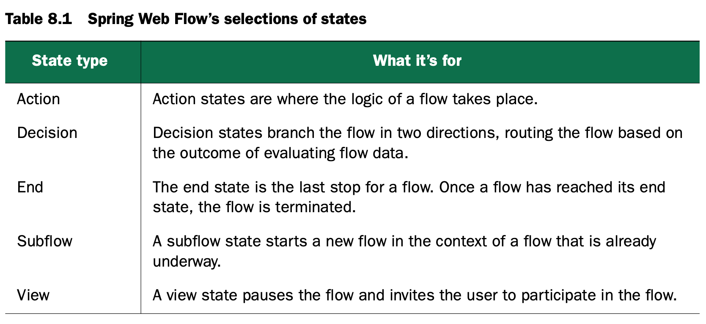
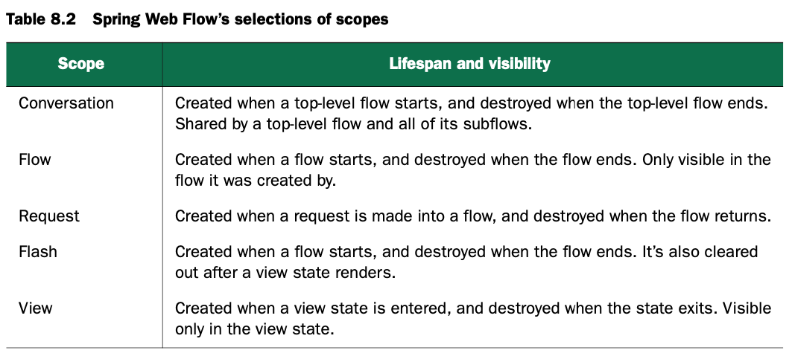

# Working with Spring Web Flow

超链接是互联网的核心。互联网让人很容易迷失其中，这也是互联网的魅力所在，但是有些应用需要引导用户走流程，比如商城应用，从添加商品到购物车，到购物车详情，到下单支付，已经订单支付成功。

本章介绍Spring Web Flow，它是Spring MVC的扩展，辅助流程型应用的开发。

## 8.1 Configuring Web Flow in Spring

目前配置只能采用XML配置方式，所以在配置时需要引入相关的命名空间：

```xml
<?xml version="1.0" encoding="UTF-8"?>
<beans xmlns="http://www.springframework.org/schema/beans"
       xmlns:xsi="http://www.w3.org/2001/XMLSchema-instance"
       xmlns:flow="http://www.springframework.org/schema/webflow-config"
       xsi:schemaLocation="http://www.springframework.org/schema/webflow-config
                           http://www.springframework.org/schema/webflow-config/[CA]spring-webflow-config-2.3.xsd
                           http://www.springframework.org/schema/beans
                           http://www.springframework.org/schema/beans/spring-beans.xsd">
```

### 8.1.1 Wiring a flow executor

```xml
<flow:flow-executor id="flowExecutor" />
```

### 8.1.2 Configuring a flow registry

```xml
<flow:flow-registry id="flowRegistry" base-path="/WEB-INF/flows">
  <flow:flow-location-pattern value="*-flow.xml" />
</flow:flow-registry>
```

或者指定具体的id：

```xml
<flow:flow-registry id="flowRegistry">
  <flow:flow-location id="pizza" path="/WEB-INF/flows/springpizza.xml" />
</flow:flow-registry>
```

### 8.1.3 Handling flow requests

```xml
<bean class= "org.springframework.webflow.mvc.servlet.FlowHandlerMapping">
  <property name="flowRegistry" ref="flowRegistry" />
</bean>
```

```xml
<bean class= "org.springframework.webflow.mvc.servlet.FlowHandlerAdapter">
  <property name="flowExecutor" ref="flowExecutor" />
</bean>
```

## 8.2 The components of a flow

在Spring Web Flow中，一个flow由3部分组成：state、transition、flow data。

### 8.2.1 States

Spring Web Flow 定义了5中states，如下图所示：



**VIEW STATES**

向用户展示信息并且允许用户进行交互

```xml
<view-state id="welcome" view="greeting"/>
<view-state id="takePayment" model="flowScope.paymentDetails"/>
```

**ACTION STATES**

对某个方法进行调用，并且向另一状态转移

```xml
<action-state id="saveOrder">
  <evaluate expression="pizzaFlowActions.saveOrder(order)"/>
  <transition to="thankYou"/>
</action-state>
```

**DECISION STATES**

flow一定会有分支

```xml
<decision-state id="checkDeliveryArea">
  <if test="pizzaFlowActions.checkDeliveryArea(customer.zipCode)"
      then="addCustomer"
      else="deliveryWarning" />
</decision-state>
```

**SUBFLOW STATES**

```xml
<subflow-state id="order" subflow="pizza/order"> <input name="order" value="order"/>
  <transition on="orderCreated" to="payment" />
</subflow-state>
```

**END STATES**

```xml
<end-state id="customerReady" />
```

### 8.2.2 Transitions

```xml
<transition to="customerReady" />
```

一般是`<action-state>`、`<view-state>`和`subflow-state`的子标签。

```xml
<transition on="phoneEntered" to="lookupCustomer"/>
```

可以用on来指定触发，也可以由exception触发

```xml
<transition on-exception="com.springinaction.pizza.service.CustomerNotFoundException"
            to="registrationForm" />
```

**GLOABAL TRANSITIONS**

为了避免代码重复，可以使用全局设置

```xml
<global-transitions>
  <transition on="cancel" to="endState" />
</global-transitions>
```

### 8.2.3 Flow data

状态转换中间可能需要传递数据。

**DECLARING VARIABLES**

```xml
<var name="customer" class="com.springinaction.pizza.domain.Customer"/>
```

可以通过`evaluate`使用SpEL表达式

```xml
<evaluate result="viewScope.toppingsList"
          expression="T(com.springinaction.pizza.domain.Topping).asList()" />
```

相似的，可以用`<set>`

```xml
<set name="flowScope.pizza"
     value="new com.springinaction.pizza.domain.Pizza()" />
```

**SCOPING FLOW DATA**

flow里面数据的生命周期和可见性取决于作用域。



当使用`<var>`标签声明数据时，作用域总是flow-scoped；当使用`<set>`或者`<evaluate>`，作用域从name或者result的前缀可以看出，例如

```xml
<set name="flowScope.theAnswer" value="42"/>
```

## 8.3 Putting it all together: the pizza flow

