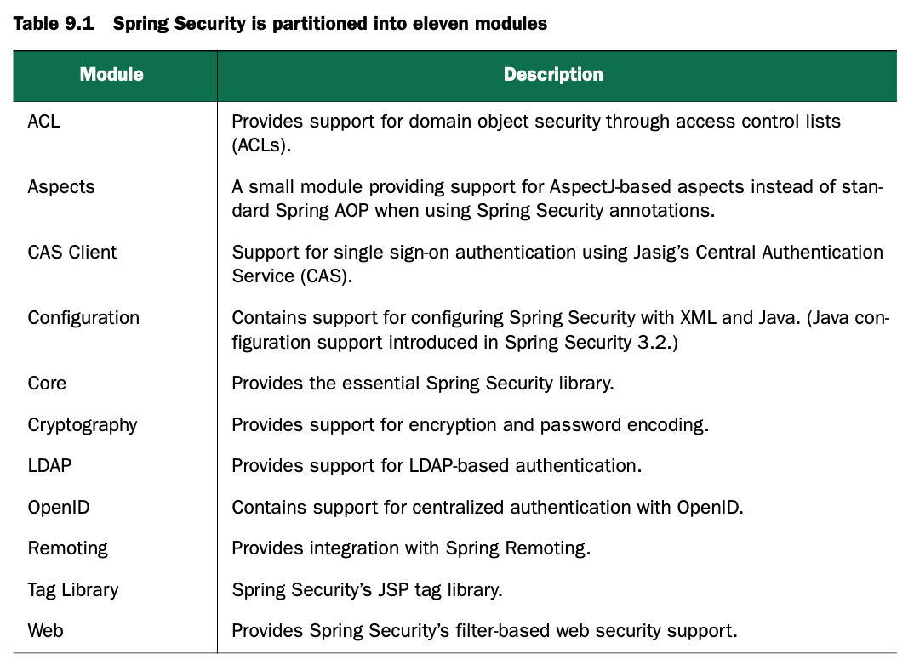
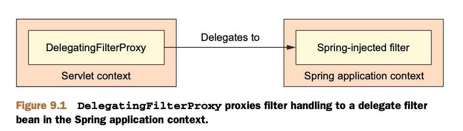

# Securing web application

web应用的安全性十分重要，但是业务逻辑不应该负责安全；所以安全逻辑应该独立于业务逻辑。

## 9.1 Getting started with Spring Security

Spring Security是一个提供声明式安全配置的框架，可以提供request级别和方法级别的验证和授权，支持依赖注入和面向切面编程。

开始的时候是Acegi Security，需要进行大量的XML配置；2.0以后更名为Spring Security，简化了大量的配置；3.0后增加了SpEL等特性。

3.2版本的Spring Security可以从两个角度给出安全解决方案：使用servlet filter保证request的安全，使用AOP实现方法级别的安全。

### 9.1.1 Understanding Spring Security modules

Spring Security 3.2版本分为以下9个模块



我们的应用中至少要引入Core和Configuration模块，通常web应用还要引入Web模块，如果使用了JSP，还要引入Tag Library。

### 9.1.2 Filtering web requests

不要担心要进行很多配置，因为你只需要配置一个filter。

DelegatingFilterProxy是一个很特别的servlet filter，它会委托给spring application context中注册的一个`javax.servlet.Filter`来实现。如下图所示



如果使用web.xml配置应用，那么可以进行如下配置

```xml
<filter>
  <filter-name>springSecurityFilterChain</filter-name>
  <filter-class>
    org.springframework.web.filter.DelegatingFilterProxy
  </filter-class>
</filter>
```

如果使用java配置应用，那么可以继承如下类

```java
package spitter.config;
import org.springframework.security.web.context.AbstractSecurityWebApplicationInitializer;

public class SecurityWebInitializer extends AbstractSecurityWebApplicationInitializer {}
```

不管你使用上面哪种方式进行配置，所有请求都会被委托给你个名为springSecurityFilterChain的bean。

### 9.1.3 Writing a simple security configuration

