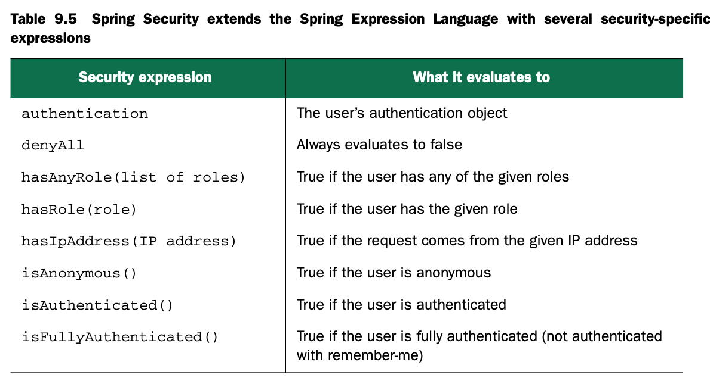

# Securing web application

web应用的安全性十分重要，但是业务逻辑不应该负责安全；所以安全逻辑应该独立于业务逻辑。

## 9.1 Getting started with Spring Security

Spring Security是一个提供声明式安全配置的框架，可以提供request级别和方法级别的验证和授权，支持依赖注入和面向切面编程。

开始的时候是Acegi Security，需要进行大量的XML配置；2.0以后更名为Spring Security，简化了大量的配置；3.0后增加了SpEL等特性。

3.2版本的Spring Security可以从两个角度给出安全解决方案：使用servlet filter保证request的安全，使用AOP实现方法级别的安全。

### 9.1.1 Understanding Spring Security modules

Spring Security 3.2版本分为以下9个模块


我们的应用中至少要引入Core和Configuration模块，通常web应用还要引入Web模块，如果使用了JSP，还要引入Tag Library。

### 9.1.2 Filtering web requests

不要担心要进行很多配置，因为你只需要配置一个filter。

DelegatingFilterProxy是一个很特别的servlet filter，它会委托给spring application context中注册的一个`javax.servlet.Filter`来实现。如下图所示


如果使用web.xml配置应用，那么可以进行如下配置

```xml
<filter>
  <filter-name>springSecurityFilterChain</filter-name>
  <filter-class>
    org.springframework.web.filter.DelegatingFilterProxy
  </filter-class>
</filter>
```

如果使用java配置应用，那么可以继承如下类

```java
package spitter.config;
import org.springframework.security.web.context.AbstractSecurityWebApplicationInitializer;

public class SecurityWebInitializer extends AbstractSecurityWebApplicationInitializer {}
```

不管你使用上面哪种方式进行配置，所有请求都会被委托给你个名为springSecurityFilterChain的bean。

### 9.1.3 Writing a simple security configuration

Java配置方式的最简配置

```java
package spitter.config;

import org.springframework.context.annotation.Configuration;
import org.springframework.security.config.annotation.web.configuration.EnableWebSecurity; import org.springframework.security.config.annotation.web.configuration.WebSecurityConfigurerAdapter;

@Configuration
@EnableWebSecurity
public class SecurityConfig extends WebSecurityConfigurerAdapter {
}
```

如果开发Spring MVC应用：

```java
package spitter.config;

import org.springframework.context.annotation.Configuration;
import org.springframework.security.config.annotation.web.configuration.WebSecurityConfigurerAdapter;
import org.springframework.security.config.annotation.web.servlet.configuration.EnableWebMvcSecurity;

@Configuration
@EnableWebMvcSecurity
public class SecurityConfig extends WebSecurityConfigurerAdapter {
}
```


举个例子：

```java
protected void configure(HttpSecurity http) throws Exception {
  http.authorizeRequest()
    .anyRequest().authenticated()
    .and()
    .formLogin().and()
    .httpBasic();
}
```

## 9.2 Selecting user details services

### 9.2.1 Working with an in-memory user store

```java
package spitter.config;

import org.springframework.beans.factory.annotation.Autowired;
import org.springframework.context.annotation.Configuration;
import org.springframework.security.config.annotation.authentication.builders.AuthenticationManagerBuilder;
import org.springframework.security.config.annotation.web.configuration.WebSecurityConfigurerAdapter;
import org.springframework.security.config.annotation.web.servlet.configuration.EnableWebMvcSecurity;


@Configuration
@EnableWebMvcSecurity
public class SecurityConfig extends WebSecurityConfigurerAdapter {
  
  @Override
  protected void configure(AuthenticationManagerBuilder auth) throws Exception {
    auth.inMemoryAuthentication()
      .withUser("user").password("password").roles("USER").and()
      .withUser("admin").password("password").roles("USER", "ADMIN");
  }
}
```


注意`roles()`是`authorities()`的一种简单写法，`.roles("USER")`等价于`.authorites("ROLE_USER")`。

### 9.2.2 Authenticating against database tables

用关系型数据库存储用户信息是十分常见的，配置举例：

```java
@Autowired
DataSource dataSource;

@Override
protected void configure(AuthenticationManagerBuilder auth) throws Exception {
  auth.jdbcAuthentication()
    .dataSource(dataSource);
}
```

**自定义SQL语句**

默认SQL语句为

```java
public static final String DEF_USERS_BY_USERNAME_QUERY =
        "select username,password,enabled " +
        "from users " +
        "where username = ?";
public static final String DEF_AUTHORITIES_BY_USERNAME_QUERY =
        "select username,authority " +
        "from authorities " +
        "where username = ?";
public static final String DEF_GROUP_AUTHORITIES_BY_USERNAME_QUERY =
"select g.id, g.group_name, ga.authority " +
"from groups g, group_members gm, group_authorities ga " + "where gm.username = ? " +
"and g.id = ga.group_id " +
"and g.id = gm.group_id";
```

如果自己定义的数据库符合这些语句，那就OK了；但是很大可能是自定义的数据库与这些语句不相符，所以可以通过如下方式修改默认的的语句：

```java
@Override
protected void configure(AuthenticationManagerBuilder auth) throws Exception {
  auth.jdbcAuthentication()
    .dataSource(dataSource)
    .usersByUsernameQuery("select username, password, true from Spitter where username=?")
    .authoritiesByUsernameQuery("select username, 'ROLE_USER' from Spitter where username=?");
}
```

**处理加密后的密码**

```java
@Override
protected void configure(AuthenticationManagerBuilder auth) throws Exception {
  auth.jdbcAuthentication()
    .dataSource(dataSource) .usersByUsernameQuery("select username, password, true from Spitter where username=?")
    .authoritiesByUsernameQuery("select username, 'ROLE_USER' from Spitter where username=?")
    .passwordEncoder(new StandardPasswordEncoder("53cr3t"));
}
```

当然也可以自定义加密函数，只要实现PasswordEncoder接口即可。

### 9.2.3 Applying LDAP-backed authentication

> LDA：Light Directory Access Protocol，轻量级目录访问协议。
>
> 特点：
>
> ​	TCP/IP协议
>
> ​	树结构
>
> ​	读快、写慢
>
> ​	服务端存、客户端读
>
> ​	跨平台
>
> ​	支持SSL/TLS
>
> ​	开放协议

```java
@Override
protected void configure(AuthenticationManagerBuilder auth) throws Exception {
  auth.ldapAuthentication()
    .userSearchBase("ou=people")
    .userSearchFilter("(uid={0})")
    .groupSearchBase("ou=groups")
    .groupSearchFilter("member={0}");
}
```

配置带加密的密码比对：

```java
@Override
protected void configure(AuthenticationManagerBuilder auth) throws Exception {
  auth.ldapAuthentication()
    .userSearchBase("ou=people")
    .userSearchFilter("(uid={0})")
    .groupSearchBase("ou=groups")
    .groupSearchFilter("memeber={0}")
    .passwordCompare()
    .passwordEncoder(new Md5PasswordEncoder())
    .passwordAttribute("password");
}
```

配置LDAP的服务器：

```java
@Override
protected void configure(AuthenticationManagerBuilder auth) throws Exception {
  auth.ldapAuthentication()
    .userSearchBase("ou=people")
    .userSearchFilter("(uid={0})")
    .groupSearchBase("ou=groups")
    .groupSearchFilter("memeber={0}")
    .contextSource()
    .url("ldap://habuma.com:389/dc=habuma,dc=com");
}
```

### 9.2.4 Configuring a custom user service

加入你想用非关系型数据库（例如MongoDB或者Neo4j）进行用户认证：

```java
package spittr.security;

import org.springframework.security.core.GrantedAuthority;
import org.springframework.security.core.authority.SimpleGrantedAuthority;
import org.springframework.security.core.userdetails.User;
import org.springframework.security.core.userdetails.UserDetails;
import org.springframework.security.core.userdetails.UserDetailsService;
import org.springframework.security.core.userdetails.UsernameNotFoundException;
import spittr.Spitter;
import spittr.data.SpitterRepository;

public class SpitterUserService implements UserDetailsService {
  
  private final SpitterRepository spitterRepository;
  
  public SpitterUserService(SpitterRepository spitterRepository) {
    this.spitterRepository = spitterRepository;
  }
  
  @Override
  public UserDetails loadUserByUsername(String username) throws UsernameNotFoundException {
    
    Spitter spitter = spitterRepository.findByUsername(username);
    if (spitter != null) {
      List<GrantedAuthority> authorities = new ArrayList<GrantedAuthority>();
      authorities.add(new SimpleGrantedAuthority("ROLE_SPITTER"));
      
      return new User(spitter.getUsername(), spitter.getPassword(), authorities);
    }
    
    throw new UsernameNotFoundException("User '" + username + "' not found.");
  }
}
```

并且

```java
@Autowired
SpitterRepository spitterRepository;

@Override
protected void configure(AuthenticationManagerBuilder auth) throws Exception {
  auth
    .userDetailsService(new SpitterUserService(spitterRepository));
}
```

## 9.3 Intercepting requests

拦截请求，应该使用`configure(HttpSecurity http)`，例如：

```java
@Override
protected void configure(HttpSecurity http) throws Exception {
  http.authorizedRequests()
    .antMatchers("/spitters/me").authenticated()
    .antMatchers(HttpMethod.POST, "/spittles").authenticated()
    .anyRequest().permitAll();
}
```

也可以使用`.antMatchers("/spitters/**", "spittles/mine").authenticated()`，更多配置：


`hasRole()`是`hasAuthority()`的简写：

```java
@Override
protected void configure(HttpSecurity http) throws Exception {
  http.authorizeRequests()
    .antMatchers("/spitters/me").hasAuthority("ROLE_SPITTER")
    .antMatchers(HttpMethod.POST, "/spittles")
    .hasAuthority("ROLE_SPITTER")
    .anyRequest().permitAll();
}

// 等价于
@Override
protected void configure(HttpSecurity http) throws Exception {
  http.authorizeRequests()
    .antMatchers("/spitter/me").hasRole("SPITTER")
    .antMatchers(HttpMethod.POST, "/spittles").hasRole("SPITTER")
    .anyRequest().permitAll();
}
```

### 9.3.1 Securing with Spring Expressions

为了更方便地配置，可以使用SpEL，比如：

```java
.antMatchers("/spitter/me").access("hasRole('ROLE_SPITTER')")
```

或者

```java
.antMatchers("/spitter/me")
  .access("hasRole('ROLE_SPITTER') and hasIpAddress('192.168.1.2')")
```

SpEL支持的表达式：




### 9.3.2 Enforcing channel security

首先要清楚一点HTTP传输的数据是不加密的，如果需要传输敏感信息需要通过HTTPS。Spring可以强制要求某个请求使用HTTPS，例如：

```java
@Override
protected void configure(HttpSecurity http) throws Exception {
  http.authorizeRequests()
    .antMatchers("/spitter/me").hasRole("SPITTER")
    .antMatchers(HttpMethod.POST, "/spittles").hasRole("SPITTER")
    .anyRequest().permitAll()
    .and().requiresChannel().antMatchers("/spitter/form").requiresSecure();
}
```

### 9.3.3 Preventing cross-site request forgery

CSRF问题危害很大，Spring Security是默认开启的，通过token实现。所以前端发请求时需要增加这个隐藏token：

```html
<!-- 如果使用Thymeleaf -->
<form methot="POST" th:action="@{/spittels}">
  ...
</form>

<!-- 如果使用JSP -->
<input type="hidden"
       name="${_csrf.parameterName}"
       value="${_csrf.token} "/>
```

当然你清楚自己在做什么，而且可以承担其中的风险，可以选择关闭CSRF保护：

```java
@Override
protected void configure(HttpSecurity http) throws Exception {
  http.csrf().disable();
}
```

## 9.4 Authentication users

按照如下方式会使用简单的login页面：

```java
@Override
protected void configure(HttpSecurity http) throws Exception {
  http.formLogin()
    .and().authorizeRequests()
    .antMatchers("/spitter/me").hasRole("SPITTER")
    .antMatchers(HttpMethod.POST, "/spittles").hasRole("SPITTER") .anyRequest().permitAll()
    .and().requiresChannel()
    .antMatchers("/spitter/form").requiresSecure();
}
```

### 9.4.1 Adding a custom login page

```html
<html>
  <head><title>Login Page</title></head>
  <body onload='document.f.username.focus();'> <h3>Login with Username and Password</h3>
    <form name='f' action='/spittr/login' method='POST'>
      <table>
        <tr><td>User:</td><td>
          <input type='text' name='username' value=''></td></tr>
        <tr><td>Password:</td>
          <td><input type='password' name='password'/></td></tr>
        <tr><td colspan='2'>
          <input name="submit" type="submit" value="Login"/></td></tr>
        <input name="_csrf" type="hidden" value="6829b1ae-0a14-4920-aac4-5abbd7eeb9ee" />
      </table>
    </form>
  </body>
</html>
```

### 9.4.2 Enabling HTTP Basic authentication

```java
@Override
protected void configure(HttpSecurity http) throws Exception {
  http.formLogin()
    .loginPage("/login")
    .and().httpBasic().realmName("Spittr")
    .and()
    ...
}
```

### 9.4.3 Enabing remeber-me functionality

```java
@Override
protected void configure(HttpSecurity http) throws Exception {
  http.formLogin().loginPage("/login")
    .and().rememberMe().tokenValiditySeconds(2419200).key("mySecretKey")
    .and()
    ...
}
```

注意页面也要传对应的参数

```html
<input id="remember_me" name="remember-me" type="checkbox" />
<label for="remeber_me" class="inline">Remeber me</label>
```

### 9.4.4 Logging out

Logout已经默认实现了（通过filter实现，LogoutFilter），拦截对`/logout`的请求，只需要在页面增加相应的链接即可：

```html
<a th:href="@{/logout}">Logout</a>
```

点击链接之后，Spring Security会删除remember-me的token、用户登出、重定向到`/login?logout`。

用户也可以自定义logout链接和登出成功的跳转链接：

```java
@Override
protected void configure(HttpSecurity http) throws Exception {
  http.formLogin().loginPage("/login")
    .and()
    .logout().logoutSuccessUrl("/").logoutUrl("/signout");
}

```

## 9.5 Securing the view

感觉不用，后面再看

## 9.6 Summary

再把上面的内容看一遍。