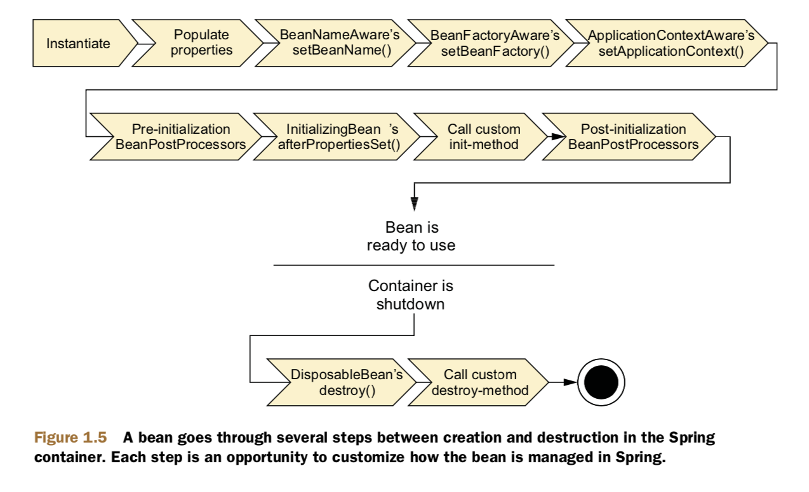

# 1 spring into action

## 1.1 简化Java开发

spring给出了大胆的目标——简化Java开发，为了实现这一点，spring有以下4个策略：

- Lightweight and minimally invasive development with POJOs
- Loose coupling through DI and interface orientation
- Declarative programming through aspects and common conventions
- Eliminating boilerplate code with aspects and templates

### 1.1.1 Unleashing the power of POJOs

spring几乎不会要求用户在代码中使用spring的各种API（例如实现接口或者继承抽象类），所以使用spring之后，代码中仍然是POJO（Plain Old Java Object）；POJO既保证了代码简洁，而且配合spring能发挥超强的作用。

###1.1.2 Injecting dependencies

依赖注入（Dependency Injection）听起来可能是高端编程技巧或者是设计模式之类的，但其实并不像听起来那么复杂。使用依赖注入可以简化代码，便于理解，而且容易测试。

- **DI如何工作**

通常的程序包含两个以上的类来实现某个功能，传统做法是每个类负责获取它使用的依赖类，这会导致代码高度耦合而且难以测试。

使用DI，类在创建时由第三方提供它所需要的依赖类，这样目标类别就不需要自己去创建和获取依赖类了。

一方面，那么使用DI时如果依赖的是个接口，目标类就不需要去关心依赖类的具体实现，可能A版本实现也可能是B版本实现，这样就把程序进行了解耦；另一方面，那么使用DI时，测试就变得十分简单，我们可以mock一个依赖类去单独测试目标类。

- **如何进行DI**

DI的整个过程类似于布线（wiring，咋翻？），spring中通常使用xml文件进行bean/component管理。通常spring的xml文件样式如下：

```xml
<?xml version="1.0" encoding="UTF-8"?>
<beans xmlns="http://www.springframework.org/schema/beans"
       xmlns:xsi="http://www.w3.org/2001/XMLSchema-instance"
       xsi:schemaLocation="http://www.springframework.org/schema/beans
                           https://www.springframework.org/schema/beans/spring-beans.xsd">

  <bean id="..." class="...">   
    <!-- collaborators and configuration for this bean go here -->
  </bean>

  <bean id="..." class="...">
    <!-- collaborators and configuration for this bean go here -->
  </bean>

  <!-- more bean definitions go here -->

</beans>
```

同时spring还支持java代码配置

```java
@Configuration
public class SomeConfig {
  
  @Bean
  public SomeClass someClass() {
    return new SomeClass(dependency01());
  }
  
  @Bean
  public Dependency01 dependency01() {
    return new Dependency01(dependency02());
  }
  
  @Bean
  public Denpendency02 dependency02() {
    return new Denpendency02();
  }
}
```

无论是哪种配置方式，任何依赖类的替换都只需要修改配置，而不用去修改业务代码。

- 让程序运行

在spring程序中，`application context`负责载入和配置bean，一般的使用方法如下：

```java
ApplicationContext context = new ClassPathXmlApplicationContext("some.xml", "other.xml");
XXX xxx = context.getBean(XXX.class);
```

### 1.1.3 使用切面

对于程序的功能划分，每个类都有自己的职责，如果说这种划分属于纵向划分，那么总有一些功能横跨很多模块，比如日志、事务管理和安全等，那这种划分就是横向划分。这种横向情况通常会带来两个问题：

- 代码重复：如果不抽离，那么修改时需要各处修改；即使抽离成单独的函数，调用也会发生在各处
- 职能混淆：安全问题不应该由具体业务代码考虑（违反单一权限原则）

AOP抽象横向功能成为单独模块，并以声明式的方式使用。***Aspects ensure that POJOs remain plain.*** 注意AOP的使用需要特殊的配置：

```xml
<?xml version="1.0" encoding="UTF-8"?>>
<beans xmlns="http://www.springframework.org/schema/beans"
       xmlns:xsi="http://www.w3.org/2001/XMLSchema-instance"
       xmlns:aop="http://www.springframework.org/schema/aop"
       xsi:schemaLocation="http://www.springframework.org/schema/aop
                           http://www.springframework.org/schema/aop/spring-aop-3.2.xsd
                           http://www.springframework.org/schema/beans
                           http://www.springframework.org/schema/beans/spring-beans.xsd">
  <bean id="knight" class="com.springinaction.knights.BraveKnight">
    <constructor-arg ref="quest" />
  </bean>
  <bean id="quest" class="com.springinaction.knights.SlayDragonQuest"> <constructor-arg value="#{T(System).out}" />
  </bean>
  <bean id="minstrel" class="com.springinaction.knights.Minstrel">
    <constructor-arg value="#{T(System).out}" />
  </bean>
  <aop:config>
    <aop:aspect ref="minstrel">
      <aop:pointcut id="embark"
                    expression="execution(* *.embarkOnQuest(..))"/>
      <aop:before pointcut-ref="embark"
                  method="singBeforeQuest"/>
      <aop:after pointcut-ref="embark"
                 method="singAfterQuest"/>
    </aop:aspect>
  </aop:config>
</beans>
```

### 1.1.4 Eliminating boilerplate code with templates

传统的数据库查询包含如下步骤：

- 建立连接
- prepareStatement
- 查询
- 处理返回结果

而且在整个过程中还要考虑异常，另外所有工作结束之后还要记得关闭statement和连接。这种样板式的代码经常可以看到，无聊且枯燥，真正发挥功能的代码只有那么少量的几行。

spring为了解决这种问题，提供了template，比如上面提到的数据库查询，spring就提供了JDBCTemplate来取消这些样板代码，只需要写好那几行重要的业务逻辑，剩下的（异常处理、连接关闭等）都交给spring来解决。

## 1.2 容器

容器是Spring的核心，负责bean的创建、配置和注入；在spring中，有两个容器接口可供实现，`BeanFactory`和`ApplicationContext`，由于`BeanFactory`对于大多数应用来说太过简陋，所以主要使用`ApplicationContext`。

### 1.2.1 ApplicationContext使用

ApplicationContext有几种实现：

- `AnnotationConfigApplicationContext`
- `AnnotationConfigWebApplication`
- `ClassPathXmlApplicationContext`
- `FileSystemApplicationContext`
- `XmlWebApplicationContext`

创建出一个context后，就可以通过`getBean()`方法获取容器中定义过的bean

### 1.2.2 bean的生命周期



在Spring中，bean的声明周期如上图所示，如果实现过某些接口，方法就会在特定的时期执行。

## 1.3 Spring框架组成

### 1.3.1 Spring模块


上图展示了Spring 4.0版本的模块图